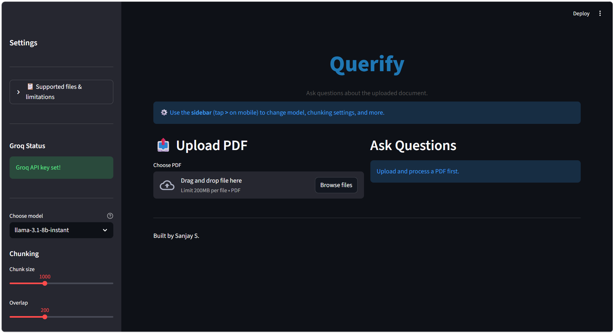
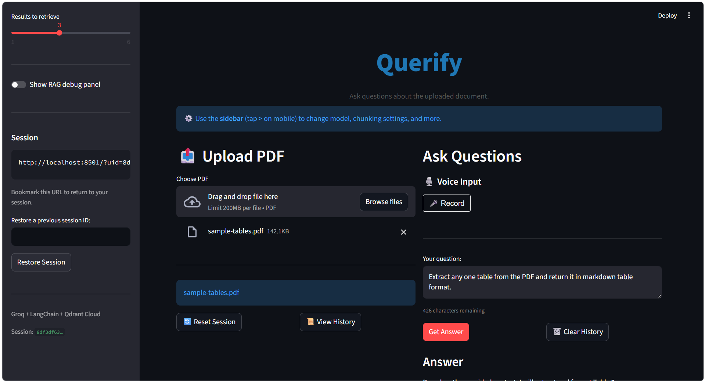
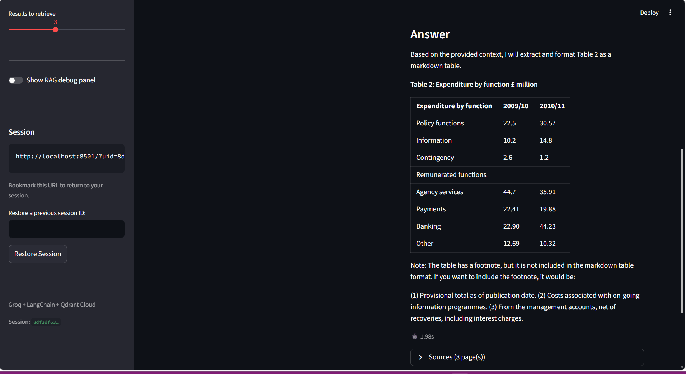

## Querify — RAG Document QA System

Chat with your PDFs. Upload a document, ask questions in plain English (or out loud), and get answers pulled directly from the content — with page-level citations.

[](https://python.org)
[](https://fastapi.tiangolo.com)
[](https://streamlit.io)
[](https://langchain.com)
[](https://groq.com)

**Live App:** https://rag-document-app-system-kc9htnpnjbzbexjdk4ws98.streamlit.app/  
**API:** https://rag-document-qa-system-1-6xi0.onrender.com

> Both run on free tiers and sleep after inactivity — first request can take 1-3 min to wake up.

## Demo

### Main Interface
<p align="center">
  
</p>

### Asking Questions
<p align="center">
  
</p>

### Table Extraction Output
<p align="center">
  
</p>

---

## What's New in v4

- **Multi-user** — Each session gets its own isolated space in Qdrant via `user_id` payload filtering. Uploads, queries, and resets are fully scoped per user
- **Persistent vectors** — Moved from in-memory Qdrant to Qdrant Cloud, so uploaded documents survive backend restarts
- **Single shared collection** — All users share one Qdrant collection (`querify_docs`) to stay under the free tier's 5-collection cap. Isolation is handled by filtering on `user_id` at query/delete time, backed by a keyword index
- **Chat history** — Q&A turns are kept in-memory per user with a 7-day TTL. No dedicated storage yet, so history is gone if the backend restarts or the free-tier instance sleeps. Your session URL encodes your session ID — bookmark it to pick up where you left off when the backend wakes back up

> **v3** — voice input, query rewriting, page citations, RAG debug panel, PyMuPDF. **v2** — FastAPI + Streamlit split. **v1** — pure Streamlit. All in git history.

---

## Features

- Upload a PDF and ask questions in plain English or by voice
- Voice transcription via Groq Whisper API (`whisper-large-v3-turbo`) — zero RAM cost, runs on Groq's servers
- Query rewriting — the LLM rephrases your question before retrieval so vague queries still find the right chunks
- Page-level citations with chunk previews for every answer
- Switch between Llama 3.1 8B (fast) and Llama 3.3 70B (better) per query
- RAG debug panel — see the rewritten query, chunks used, and chunk previews
- Bookmarkable session URLs — your session ID lives in the URL (`?uid=...`). Revisit the same link and your document and history are right where you left them, as long as the backend hasn't gone to sleep. You can also paste an old session ID in the sidebar to manually restore a previous session
- Per-user session isolation — documents and history don't bleed between sessions
- Persistent document storage via Qdrant Cloud (vectors survive restarts, unlike history)

---

## Tech Stack

**Frontend**
-  Streamlit — UI, file upload, voice recorder
-  streamlit-audiorecorder — in-browser audio capture

**Backend**
-  FastAPI — REST API (`/docs` for interactive explorer)
-  Groq — LLM inference (Llama 3.1 8B + 3.3 70B) + Whisper STT (`whisper-large-v3-turbo`)
-  all-MiniLM-L6-v2 — embeddings
-  Qdrant Cloud — persistent vector store
-  LangChain — RAG pipeline
-  PyMuPDF — primary PDF extraction (handles tables and multi-column layouts well)

---

## Getting Started

**Prerequisites**
- Python 3.12
- [Groq API key](https://console.groq.com) (free) — used for both LLM inference and Whisper STT
- [Qdrant Cloud cluster](https://cloud.qdrant.io) (free)

**Setup**

```bash
git clone https://github.com/sanjay-s22/rag-document-qa-system.git
cd rag-document-qa-system

python -m venv venv
venv\Scripts\activate        # Windows
source venv/bin/activate     # macOS/Linux

pip install -r backend/requirements.txt
pip install -r requirements.txt
```

Create a `.env` in the project root:

```
GROQ_API_KEY=gsk_your_key_here       # LLM inference
GROQ_STT_KEY=gsk_your_key_here       # Whisper STT (can be the same key)
QDRANT_URL=https://your-cluster.qdrant.io
QDRANT_API_KEY=your_qdrant_key
```

> If Qdrant credentials are not configured, the backend falls back to in-memory mode (vector data will not persist across restarts).

**Run**

```bash
# Terminal 1 — backend
cd backend
uvicorn main:app --reload

# Terminal 2 — frontend
streamlit run app.py
```

Backend runs at `http://localhost:8000`. Hit `/docs` for the Swagger UI.

---

## Usage

1. Upload a PDF and click **Process**
2. Type a question or hit **🎤 Record** to ask by voice
3. Click **Get Answer**
4. Expand **📎 Sources** to see which pages the answer came from
5. Toggle the **RAG debug panel** in the sidebar to inspect retrieval internals

---

## Configuration

| Parameter | Range | Default | Notes |
|-----------|-------|---------|-------|
| Model | 8B / 70B | 8B | Speed vs quality |
| Chunk Size | 500–2000 | 1000 | Characters per chunk |
| Chunk Overlap | 50–500 | 200 | Must be less than chunk size |
| Top-K | 1–6 | 3 | Chunks retrieved per query |

---

## Project Structure

```
rag-document-qa-system/
├── backend/
│   ├── main.py            # FastAPI routes, rate limiting, validation
│   ├── rag_service.py     # RAG pipeline — chunking, embeddings, retrieval, LLM, history
│   ├── stt_service.py     # Speech-to-text via Groq Whisper API
│   └── requirements.txt
├── docs/
│   ├── querify-home.png
│   ├── querify-query.png
│   └── querify-table-output.png
├── app.py                 # Streamlit frontend
├── requirements.txt
├── .env                   # Not tracked
└── README.md
```

---

## Architecture

```
User (text or voice)
 │
 ▼
Streamlit (app.py)
 │  HTTP + user_id per session
 ▼
FastAPI (main.py)
 ├── slowapi rate limiting
 ├── Input validation + injection filter
 │
 ├── /transcribe ──► Groq Whisper API
 │
 └── /query ──► rag_service.py
                 ├── Query rewriting (Groq LLM)
                 ├── PyMuPDF — extract
                 ├── RecursiveCharacterTextSplitter — chunk
                 ├── all-MiniLM-L6-v2 — embed
                 ├── Qdrant Cloud — search (filtered by user_id)
                 ├── Groq LLM — answer + citations
                 └── In-memory history (7-day TTL)
```

---

## Multi-User Design

Everything runs in a single Qdrant collection (`querify_docs`) to stay under the free tier's collection limit. User isolation works at the payload level — every chunk is stored with a `user_id` field, and a keyword index on that field makes filtered searches fast. Queries, deletes, and counts all go through a `user_id` filter, so users are completely isolated without needing separate collections.

Uploading a new PDF deletes the user's existing vectors first, then re-indexes the new document.

---

## API Endpoints

| Method | Endpoint | Description | Rate Limit |
|--------|----------|-------------|------------|
| `GET` | `/health` | API + Groq key status | — |
| `GET` | `/status` | Whether the user has a processed document | — |
| `POST` | `/upload` | Upload and index a PDF | 10/min |
| `POST` | `/query` | Ask a question | 20/min |
| `POST` | `/transcribe` | Transcribe audio | 10/min |
| `GET` | `/history` | Get this user's Q&A history | 30/min |
| `POST` | `/reset` | Wipe vectors + history for this user | 10/min |

---

## Input Limits

| | Limit |
|-|-------|
| PDF size | 5 MB |
| PDF pages | 12 |
| Audio size | 10 MB |
| Question length | 500 chars |
| Chunk size | 500–2000 |
| Chunk overlap | 50–500 |
| Top-K | 1–6 |
| `user_id` | UUID4, regex-validated on every request |

---

## Supported Files

| | |
|-|-|
| Text-based PDFs | ✅ |
| PDFs with tables | ✅ |
| Scanned PDFs | ❌ no OCR |
| Images / charts | ❌ |
| Handwritten text | ❌ |

---

## Security

- Rate limiting on all endpoints via slowapi (keyed by IP)
- UUID4 validation on `user_id` — rejects anything else
- PDF magic bytes check before processing
- Regex-based prompt injection filter on all queries
- Temp files cleaned up immediately after use
- CORS locked to the Streamlit Cloud URL + localhost
- No API keys in version control

`user_id` is session-scoped, not authenticated. Don't use this for sensitive documents without adding proper auth.

---

## Roadmap

- Proper auth (JWT or OAuth) tied to `user_id`
- - Persistent chat history via Redis or database-backed session storage (currently stored in-memory only)
- Streaming responses
- LLM Guard for stronger prompt safety

---

## Author

**Sanjay** · [@sanjay-s22](https://github.com/sanjay-s22)

---

Built with LangChain, Groq, FastAPI, Qdrant, Streamlit, PyMuPDF, and HuggingFace.

⭐ Star if it was useful
